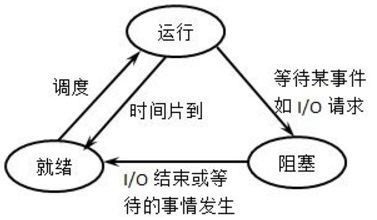

# 进程和线程的区别

## 进程 process

### 什么是进程

一个具有一定独立功能的程序关于某个数据集合的一次运行活动，是系统进行资源分配和调度运行的基本单位
 **进程与程序的差别**

- 进程是一个动态的概念，而程序只是一组指令。
- 不同的进程可以执行同一个程序
- 每个进程都有自己的生命周期
- 进程之间存在并发性
- 进程间会相互制约 在资源方面或者运行调度方面
- 进程可以创建子进程，程序不能创建子程序
- 从结构上讲，每个进程都由程序、数据和一个进程控制块（Process Control Block, PCB）组成

所以进程具有以下特征：

1. 动态特征：进程对应于程序的运行，动态产生、消亡，在其生命周期中进程也是动态的、
2. 并发特征：任何进程都可以同其他进程一起向前推进
3. 独立特征：进程是相对完整的调度单位，可以获得CPU，参与并发执行
4. 交往特征：一个进程在执行过程中可与其他进程产生直接或间接关系
5. 异步特征：每个进程都以相对独立、不可预知的速度向前推进
6. 结构特征：每个进程都有一个PCB作为他的数据结构

### 进程的运行状态



运行态：进程正在运行，也即是cpu正在它身上。

就绪(等待)态：进程可以运行，已经处于等待队列中，也就是说调度类下次可能会选中它

睡眠(阻塞)态：进程睡眠了，不可运行。

各状态之间的转换方式为：(也许可能不太好理解，可以结合稍后的例子)
(1)新状态－＞就绪态：当等待队列允许接纳新进程时，内核便把新进程移入等待队列。
(2)就绪态－＞运行态：调度类选中等待队列中的某个进程，该进程进入运行态。
(3)运行态－＞睡眠态：正在运行的进程因需要等待某事件(如IO等待、信号等待等)的出现而无法执行，进入睡眠态。
(4)睡眠态－＞就绪态：进程所等待的事件发生了，进程就从睡眠态排入等待队列，等待下次被选中执行。
(5)运行态－＞就绪态：正在执行的进程因时间片用完而被暂停执行；或者在抢占式调度方式中，高优先级进程强制抢占了正在执行的低优先级进程。
(6)运行态－＞终止态：一个进程已完成或发生某种特殊事件，进程将变为终止状态。对于命令来说，一般都会返回退出状态码

### 僵尸进程和SIGCHLD

 子进程终止、退出的时候，内核会发送SIGCHLD信号给其父进程，在子进程死亡的那一刹那，子进程的状态就是僵尸进程，但因为发出了SIGCHLD信号给父进程，父进程只要收到该信号，子进程就会被清理也就不再是僵尸进程。所以正常情况下，所有终止的进程都会有一小段时间处于僵尸态(发送SIGCHLD信号到父进程收到该信号之间)，只不过这种僵尸进程存在时间极短，资源没有被释放

### 时间片的概念

 一颗物理cpu在同一时刻只能运行一个进程，只有多颗物理cpu才能真正意义上实现多任务，在Linux上，决定下一个要运行的进程是通过"调度类"(调度程序)来实现的。根据轮询和进程的优先级别实现。进程切换不应太频繁，也不应太慢。切换太频繁将导致cpu闲置在保护和恢复现场的时间过长，保护和恢复现场对人类或者进程来说是没有产生生产力的(因为它没有在执行程序)。切换太慢将导致进程调度切换慢。所以cpu的衡量单位是时间。cpu的百分比值不是其工作强度或频率高低，而是"进程占用cpu时间/cpu总时间"（调度时间）。

### 父子进程及创建进程

每一个进程分配一个唯一的PID，进程的PPID表示的是该进程的父进程的PID，子进程总是由父进程创建。
Linux上创建子进程的方式有三种

- **fork是复制进程，它会复制当前进程的副本**(不考虑写时复制的模式)，以适当的方式将这些资源交给子进程。所以子进程掌握的资源和父进程是一样的，包括内存中的内容，所以也包括环境变量和变量。但父子进程是完全独立的，它们是一个程序的两个实例。
- **exec是加载另一个应用程序，替代当前运行的进程，也就是说在不创建新进程的情况下加载一个新程序**。exec还有一个动作，在进程执行完毕后，退出exec所在环境(实际上是进程直接跳转到exec上，执行完exec就直接退出。而非exec加载程序的方式是：父进程睡眠，然后执行子进程，执行完后回到父进程，所以不会立即退出当前环境)。所以为了保证进程安全，若要形成新的且独立的子进程，都会先fork一份当前进程，然后在fork出来的子进程上调用exec来加载新程序替代该子进程。例如在bash下执行cp命令，会先fork出一个bash，然后再exec加载cp程序覆盖子bash进程变成cp进程。但要注意，fork进程时会复制所有内存页，但使用exec加载新程序时会初始化地址空间，意味着复制动作完全是多余的操作，当然，有了写时复制技术不用过多考虑这个问题。
- **clone用于实现线程**。clone的工作原理和fork相同，但clone出来的新进程不独立于父进程，它只会和父进程共享某些资源，在clone进程的时候，可以指定要共享的是哪些资源。

### linux 下查看进程

查看进程命令ps

- PID：表示进程的ID号，类似于每个人的省份证号码。
- TTY：登入的终端类型。
- TIME：进程从启动以来占的CPU时间
- CMD：进程的命令名。

## 线程 thread

### 线程的意义

CPU调度和分派的基本单位，进程中_执行运算的最小单位_，一个标准的线程由线程ID，当前指令指针(PC），寄存器集合和堆栈组成。 而线程是进程的一个实体，是系统独立调度和分派的基本单位，线程自己不拥有系统资源，只拥有一点儿在运行中的资源，
轻量级进程，
java实现线程的4种方式：

- 1:继承Therad类，**重写run方法**
- 2：实现Runnable接口 **重写run方法**
- 3：通过Callable和FutureTask创建线程
- 4：使用线程池
  后两种就要实现call方法，这个方法的返回值是Object，所以返回的结果可以放在Object对象中

### 线程安全

当多个线程同时访问同一个资源的时候，就会存在一个问题。

多线程同步和互斥有几种实现方法，都是什么？
线程间的同步方法大体可分为两类：用户模式和内核模式。顾名思义，内核模式就是指利用系统内核对象的单一性来进行同步，使用时需要切换内核态与用户态，而用户模式就是不需要切换到内核态，只在用户态完成操作。
用户模式下的方法有：原子操作（例如一个单一的全局变量），临界区。内核模式下的方法有：事件，信号量，互斥量

多线程同步和互斥有何异同，在什么情况下分别使用他们？举例说明。
线程同步是指线程之间所具有的一种制约关系，一个线程的执行依赖另一个线程的消息，当它没有得到另一个线程的消息时应等待，直到消息到达时才被唤醒。 
线程互斥是指对于共享的进程系统资源，在各单个线程访问时的排它性。当有若干个线程都要使用某一共享资源时，任何时刻最多只允许一个线程去使用，其它要使用该资源的线程必须等待，直到占用资源者释放该资源。线程互斥可以看成是一种特殊的线程同步（下文统称为同步）。

临界区（Critical Section）和互斥量（Mutex）
两者都可以用于同一进程中不同子线程对资源的互斥访问。
互斥量是内核对象，因此还可以用于不同进程中子线程对资源的互斥访问。
互斥量可以很好的解决由于线程意外终止资源无法释放的问题。
临界区：一个访问共用资源（例如：共用设备或是共用存储器）的程序片段，而这些共用资源又无法同时被多个线程访问的特性。

生产者消费者问题：
**通过加锁来实现**
**通过条件变量来实现**
**生产者消费者-双缓冲**
**一个公共缓存区，由于多线程访问的锁冲突较大，可以采取双缓冲手段来解决锁的冲突**

双缓冲的关键：双缓冲队列的数据交换
1）生产者线程不断的向生产者队列A写入数据，当队列中有数据时，进行数据的交换，交换开始启动时通过条件变量通知交换线程来处理最先的数据交换。
2）数据交换完成后，通过条件变量通知消费者处理数据，此时交换线程阻塞到消费者数据处理完成时通知的条件变量上。
3）消费者收到数据交换后的通知后，进行数据的处理，数据处理完成后，通知交换线程进行下一轮的双缓冲区的数据交换。
要点：
生产者除了在数据交换时，其余时刻都在不停的生产数据。
数据交换队列需要等待消费者处理数据完成的通知，以进行下一轮交换。
消费者处理数据时，不进行数据交换，生产者同时会不断的生产数据，消费者需要等待数据交换完成的通知，并且发送消费完成的通知给交换线程

**使用互斥锁的实现**
**<https://www.cnblogs.com/Forever-Kenlen-Ja/p/7811943.html>**

```language
struct Buffer 
{
    int buffer[buffer_size];
    size_t read_position; // 当前读位置
    size_t write_position; // 当前写位置
    mutex mtx; // 读写互斥
    //条件变量
    condition_variable not_full; 
    condition_variable not_empty;
}buffer_res;

Buffer *b;
Producer() {
while (g_continue）{
unique_lock<mutex> lock(b->mtx);
 while(((b->write_position + 1) % buffer_size) == b->read_position) {
        //当前缓存已经满了
        cout << "buffer is full now, producer is wating....." << endl;
        (b->not_full).wait(lock); // 等待缓存非full
    }
  }
  //也可以轮询
// 写入一个
(b->buffer)[b->write_position] = item; 
(b->write_position)++;
// 若到达最后一个, 写位置置位0  
if (b->write_position == buffer_size) b->write_position = 0;
lock.unlock();
}

// 消费者
Consumer{

while (g_continue）{
int data;
    unique_lock <mutex> lock(b->mtx);
    while (b->write_position == b->read_position)
    {   // 当前buffer 为空
        cout << "buffer is empty , consumer is waiting....." << endl;
        (b->not_empty).wait(lock);
    }
// 消费一个
  data = (b->buffer)[b->read_position]; 
  (b->read_position)++;
  (b->not_full).notify_all(); 
  lock.unlock();
  }
}
```

读者写者问题：
```language
DWORD WINAPI reader_thread(void * param)
{
	int my_id = *(int *)param;
	printf("%dth reader come\n", my_id);
	WaitForSingleObject(mutex_3, INFINITE);
	WaitForSingleObject(r, INFINITE);
	WaitForSingleObject(mutex_1, INFINITE);
	readcount += 1;
	if (readcount == 1)
		WaitForSingleObject(w, INFINITE);//只要有reader已经在read，就不让一个write去写
	ReleaseMutex(mutex_1);
	ReleaseMutex(r);
	ReleaseMutex(mutex_3);

	/*reading*/
	printf("%dth reader is doing reading\n", my_id);
	Sleep(2000);
	printf("%dth reader finish reading\n", my_id);

	WaitForSingleObject(mutex_1, INFINITE);
	readcount -= 1;
	if (readcount == 0)
		ReleaseMutex(w);
	ReleaseMutex(mutex_1);
	return 1;
}

DWORD WINAPI writer_thread(void *param)
{
	int my_id = *(int *)param;
	printf("%dth writer come\n", my_id);
	WaitForSingleObject(mutex_2, INFINITE);
	writecount += 1;
	if (writecount == 1)
		WaitForSingleObject(r, INFINITE);//只要有writer存在，就reader在后面等待
	ReleaseMutex(mutex_2);

	WaitForSingleObject(w, INFINITE);
	printf("%dth writer is writing\n", my_id);
	Sleep(2000);
	printf("%dth writer finish writing\n", my_id);

	WaitForSingleObject(mutex_2, INFINITE);
	writecount -= 1;
	if (writecount == 0)
		ReleaseMutex(r);
	ReleaseMutex(mutex_2);
	return 1;
}
```


## 两者区别

区别：
主要是线程依赖于进程的

- 线程是轻量级的进程，所消耗的资源和切换代价的比较小
- 一个进程可以包含多个线程，并且线程共享整个进程的资源，一个进程至少包含一个线程。
- 线程存在并发和资源争夺问题，当进程死掉后，会导致整个进程都会卡死掉，而进程死掉，不会影响其他的进程
- 线程有自己的私有属性TCB，线程id，寄存器、硬件上下文，而进程也有自己的私有属性进程控制块PCB，这些私有属性是不被共享的，用来标示一个进程或一个线程的标志。

进程与线程的选择取决以下几点：
1、需要频繁创建销毁的优先使用线程；因为对进程来说创建和销毁一个进程代价是很大的。
2、线程的切换速度快，所以在需要大量计算，切换频繁时用线程，还有耗时的操作使用线程可提高应用程序的响应
3、因为对CPU系统的效率使用上线程更占优，所以可能要发展到多机分布的用进程，多核分布用线程；
4、并行操作时使用线程，如C/S架构的服务器端并发线程响应用户的请求；
5、需要更稳定安全时，适合选择进程；需要速度时，选择线程更好。

参考资料
<https://www.cnblogs.com/f-ck-need-u/p/7058920.html>
